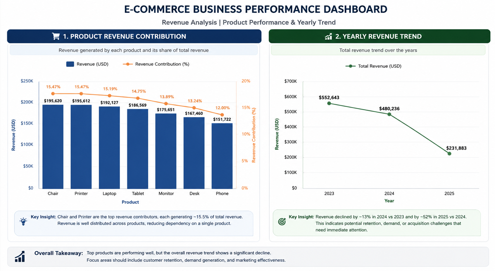

# E-Commerce Business Analysis using SQL

## Project Overview

This project focuses on analyzing e-commerce order data to understand business performance across revenue, products, customers, operations, marketing channels, and sales trends.

The goal was to move beyond writing SQL queries and answer:

**"What is happening in the business, why is it happening, and what decisions can improve performance?"**

The analysis was performed using PostgreSQL after completing data cleaning and exploratory data analysis using Python.

---

# Business Objective

An e-commerce company wants to understand:

- What drives revenue?
- Which products contribute the most business value?
- Are customers returning after purchase?
- Which marketing channels perform best?
- Where is revenue being lost?
- How is business performance changing over time?

---

# Dataset Overview

The dataset contains order-level e-commerce transactions.

Dataset Size:

- 1200 orders
- 1189 customers
- 17 analytical columns

Primary Key:

- OrderID

The dataset was first cleaned and explored using Python (Pandas + EDA) and then loaded into PostgreSQL for business analysis.

---

# Tools Used

- PostgreSQL
- pgAdmin
- SQL
- Python (Pandas)
- Git/GitHub

---

# Analysis Workflow

Raw Dataset

↓

Data Cleaning & Preparation

↓

Exploratory Data Analysis

↓

Load Clean Dataset into PostgreSQL

↓

Business-focused SQL Analysis

↓

Insights & Recommendations

---

# Key Business Insights

## Business Performance Snapshot

## 1. Revenue Performance

### Key Metrics

Total Revenue:

**$1.26M**

Average Order Value:

**$1053.96**

### Business Interpretation

The business generates high-value transactions, showing strong customer purchase capacity.

However, revenue trend analysis shows a decline over time:

- 2024 vs 2023 → approximately **13% decline**
- 2025 vs 2024 → approximately **52% decline**

### Business Impact

A 52% revenue decline in 2025 indicates potential issues with:

- customer retention
- demand changes
- acquisition effectiveness

Further investigation into customer and marketing analytics is required to identify the root cause.

---

# 2. Product Performance

### Key Findings

Highest revenue generating products:

1. Chair → ~$195K
2. Printer → ~$195K

### Business Interpretation

Chair and Printer are the strongest revenue contributors.

The balanced contribution suggests:

- demand is distributed across multiple products
- business is not dependent on a single product

### Business Action

Maintain inventory availability for top-performing products.

Lower-performing products should be evaluated through:

- pricing analysis
- customer demand
- product positioning

---

# 3. Customer Analysis

### Key Metrics

Unique Customers:

**1189**

Repeat Customers:

**11**

### Business Interpretation

The company successfully acquires customers but has very low repeat purchasing behavior.

This indicates a customer retention opportunity.

### Business Action

Improve:

- loyalty programs
- personalized recommendations
- customer engagement campaigns

---

# 4. Category Performance

### Key Finding

Highest Revenue Category:

**Electronics**

Revenue:

**~$901K**

### Business Interpretation

Electronics is the major revenue driver and should receive strategic focus for:

- inventory planning
- promotions
- product expansion

---

# 5. Order Operations

### Key Metrics

Delivered Orders:

231

Cancelled Orders:

250

Returned Orders:

247

### Business Interpretation

A high number of unsuccessful orders indicates operational inefficiencies.

Possible causes:

- fulfillment issues
- delivery problems
- customer expectation mismatch

### Business Action

Analyze cancellation and return reasons to reduce revenue leakage.

---

# 6. Marketing Analysis

### Key Finding

Top Referral Source:

**Instagram**

### Business Interpretation

Some acquisition channels generate stronger customer engagement.

Marketing investment should prioritize channels that produce higher business value.

---
# 7. Discount & Promotion Analysis

Key analysis performed:

- Discount adoption analysis
- Discount vs non-discount Average Order Value comparison
- Product-level discount dependency
- Coupon revenue contribution

### Key Finding

Discounted orders generated a slightly higher Average Order Value:

- Discount orders AOV: **$1057.64**
- Non-discount orders AOV: **$1043.37**

-- Printer - **76.8%** discounted purchases
-- Desk - **75.8%** discounted purchases

This indicates promotions may encourage higher spending, but discount strategies should be monitored to avoid dependency and protect profitability.

### Business Impact

The analysis helps identify:

- effective promotional campaigns
- products dependent on discounts
- opportunities for pricing optimization

---

# 8. Time Trend Analysis

### Analysis Performed

- Monthly revenue trend
- Month-over-month growth
- 7-day rolling average
- Yearly revenue comparison

### Business Interpretation

Trend analysis helped identify revenue fluctuations and long-term decline patterns.

This helps businesses:

- forecast demand
- plan inventory
- identify growth opportunities

---

# SQL Concepts Used

## Core SQL

- SELECT
- WHERE
- GROUP BY
- ORDER BY
- CASE Statements
- Aggregate Functions

## Advanced SQL

- CTEs
- Window Functions

Used:

- LAG() for MoM growth analysis
- DENSE_RANK() for product ranking
- Rolling AVG() for trend smoothing

---

# Repository Structure

Week_3_SQL_Analysis

│
├── Dataset
│ ├── Raw_Data.xlsx
│ └── Cleaned_Data.xlsx
│
├── Results
│ ├── category_analysis.csv
│ ├── customer_analysis.csv
│ ├── discount_analysis.csv
│ ├── marketing_analysis.csv
│ ├── operational_analysis.csv
│ ├── product_analysis.csv
│ ├── revenue_analysis.csv
│ └── time_trend_analysis.csv
│
├── Images
│   └── business_dashboard.png
|
├── 02_SQL_Buisness_Analysis.sql
├── 01_EDA_EcommerceE_Analysis.ipynb
├── SQL_questions.md
├── SQL_Insights.md
└── README.md

---

# Conclusion

This project demonstrates an end-to-end data analytics workflow:

**Data Cleaning → EDA → SQL Analysis → Business Insights**

The focus was not only calculating metrics but understanding what those metrics mean for business decisions.